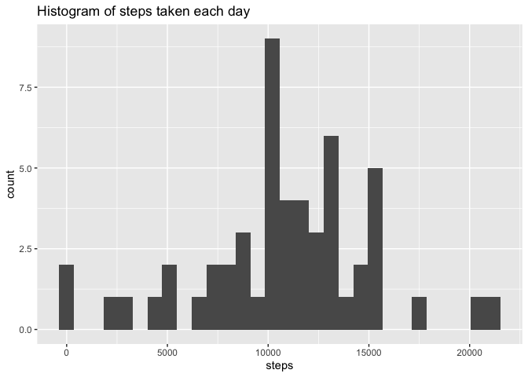
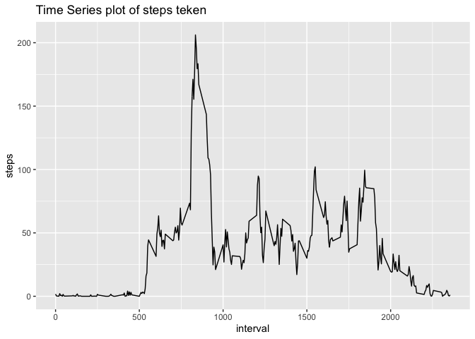
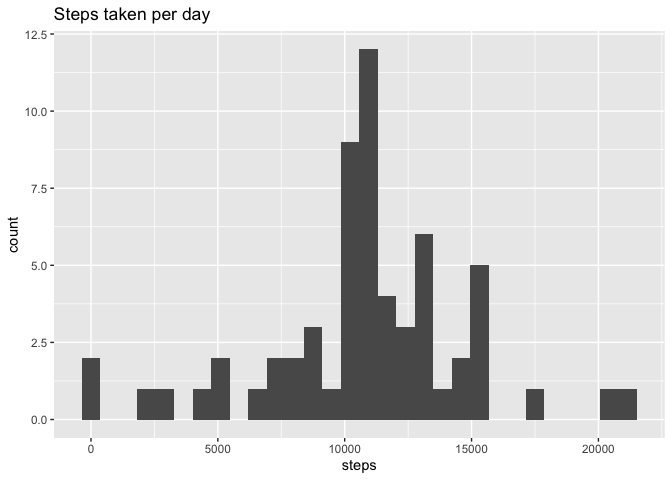
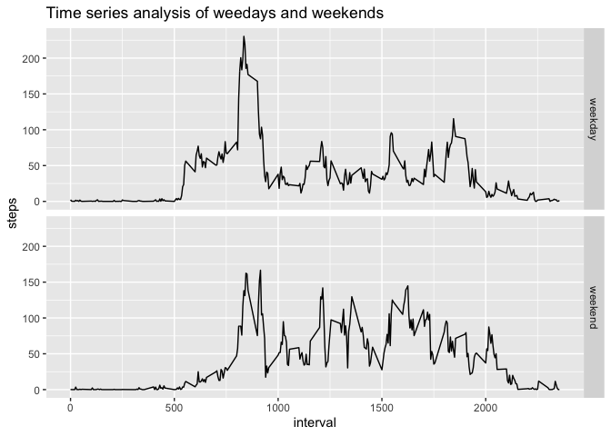

## Loading and preprocessing the data

1. Here we extract data from zip file and load it into variable **data**.  
2. First we convert date column to Date format and infer corresponding weekday.  


```r
library(ggplot2)
library(dplyr)
library(xtable)

unzip("./activity.zip")
data <- read.csv("./activity.csv")
data$date <- as.Date(data$date)
data$dayofweek <- weekdays(data$date)
```

## What is mean total number of steps taken per day?

```r
## Calculate total number of steps taken each day
data_plot <- data %>%
  filter(!is.na(steps)) %>%
  group_by(date) %>%
  summarise(steps=sum(steps))

# Plot hitogram of steps taken
g <- ggplot(data_plot, aes(steps))
g + geom_histogram() + ggtitle("Histogram of steps taken each day")
```

<!-- -->

```r
# Calculate and print mean and median of steps taken
data_summary_original <- data_plot %>%
  summarise(mean = mean(steps), median=median(steps))
```
* Mean of steps taken per day: 1.0766189\times 10^{4}  
* Median of steps taken per day: 10765  

## What is the average daily activity pattern?

```r
data_plot <- data %>%
  filter(!is.na(steps)) %>%
  group_by(interval) %>%
  summarise(steps=mean(steps))

g <- ggplot(data_plot, aes(interval, steps))
g + geom_line() + ggtitle("Time Series plot of steps teken")
```

<!-- -->


```r
active_interval <- data_plot %>% filter(steps == max(steps))
```

Interval **835** contains maximum number of steps.  

## Imputing missing values


```r
# Count NA values
nacount <- sum(is.na(data$steps))

# Impute missing data
data_nona <- data %>% filter(!is.na(steps))
data_na <- data %>% filter(is.na(steps))
data_na <- subset(data_na, select = -c(steps))
mean_steps <- data_nona %>%
  group_by(interval) %>%
  summarise(steps=mean(steps))
data_na <- data_na %>% merge(mean_steps, on="interval")

# Create new dataset with imputed values
data_imputed <- data_na %>% merge(data_nona, all = TRUE)
data_imputed <- data_imputed[order(data_imputed$date),]

# Total steps taken per day
steps_per_day <- data_imputed %>%
  group_by(date) %>% 
  summarise(steps=sum(steps))

# Histograms of steps taken per day
g <- ggplot(steps_per_day, aes(steps))
g + geom_histogram() + ggtitle("Steps taken per day")
```

<!-- -->

```r
# Calculate mean and median of steps taken per day
data_summary_imputed <- steps_per_day %>%
  summarise(mean=mean(steps), median=median(steps))
```

* Number of missing values in dataset: 2304
* Mean of steps taken per day (dropping NA): 1.0766189\times 10^{4}  
* Mean of steps taken per day (imputed): 1.0766189\times 10^{4}  
* Median of steps taken per day (dropping NA): 10765  
* Median of steps taken per day (Imputed): 1.0766189\times 10^{4} 

As we can see, mean has remained unchanged while there is little increase in median
after imputing missing data.

## Are there differences in activity patterns between weekdays and weekends?

```r
# Create a dataframe with factor variable
week <- data.frame(unique(data$dayofweek))
names(week) <- c("dayofweek")
week$type <- as.factor(c("weekday","weekday","weekday","weekday","weekday","weekend","weekend"))
data_panel_plot <- data_imputed %>% merge(week, by="dayofweek")
data_panel_plot <- data_panel_plot %>%
  group_by(interval, type) %>%
  summarise(steps=mean(steps))

# Create a panel plot
g <- ggplot(data_panel_plot, aes(interval,steps))
g + geom_line() + facet_grid(type~.) + ggtitle("Time series analysis of weedays and weekends")
```

<!-- -->
